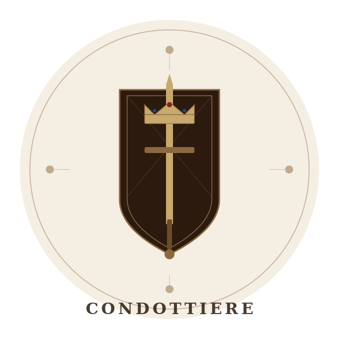

  

[Game Design Document](GDD.md)

# Mercenary

> A 4-player digital area control card strategy game set in the medieval British Isles.

---

## Overview

Mercenary is a digital adaptation of the board game **Condottieri**, rebuilt with revised core rules and set across 16 regions of the British Isles. Players choose a faction, deploy mercenary armies through card battles, and fight to conquer territory.

---

## Built With

- **Engine:** Godot 4
- **Version Control:** Git / GitHub
- **Genre:** Area Control / Card Strategy
- **Players:** 4
- **Play Time:** 30–60 minutes

---

## How to Win

- Control **5 total regions**, or
- Control **3 adjacent regions**

---

## Factions

| Faction | Ability | Description |
|---------|---------|-------------|
| Scotland | Highland Morale | +1 to each Mercenary's strength at Comparison Phase |
| Ireland | Spy Work | Swap one card from hand with an opponent's card on the battlefield |
| Wales | Storm Control | Discard all season cards in play, costs one card from battle line |
| England | Bluff | All played cards placed face down until Comparison Phase |

---

## Card Types

| Card | Count | Effect |
|------|-------|--------|
| Mercenary (1) | 10 | Strength 1 |
| Mercenary (2–6) | 8 each | Strength 2–6 |
| Mercenary (10) | 8 | Strength 10 |
| Winter | 2 | All Mercenaries count as strength 1 |
| Spring | 2 | +3 to highest strength Mercenaries |
| Autumn | 2 | Scarecrow and Surrender cannot be played |
| Bishop | 3 | Discards all highest-strength Mercenaries, grants Favor of the Pontiff |
| Courtesan | 12 | Most Courtesans wins the Conquer Token regardless of battle outcome |
| Drummer | 6 | Doubles printed strength of all Mercenaries in your line |
| Heroine | 3 | Flat strength 10, immune to all modifiers |
| Scarecrow | 16 | Retrieve one of your Mercenaries from battlefield to hand |
| Surrender | 3 | Ends battle immediately, current leader takes the region |

---

## Ability Resolution Order

1. Surrender
2. Bishop
3. Scarecrow
4. Drummer
5. Autumn
6. Winter / Spring
7. Faction Abilities
8. Courtesan

---

## Map — 16 Regions

| # | Territory | Adjacent Regions |
|---|-----------|-----------------|
| 1 | Highlands | Grampian, Strathclyde |
| 2 | Grampian | Highlands, Strathclyde, Dunwall |
| 3 | Strathclyde | Grampian, Highlands, Northumbria |
| 4 | Northumbria | Strathclyde, Yorkshire, Mercia |
| 5 | Yorkshire | Northumbria, Mercia, East Anglia |
| 6 | Mercia | Northumbria, Yorkshire, Wales, East Anglia |
| 7 | Wales | Mercia, East Anglia, Somerset, Wessex |
| 8 | East Anglia | Yorkshire, Mercia, Wales, Wessex, Essex |
| 9 | Somerset | Wales, Wessex |
| 10 | Wessex | Wales, East Anglia, Somerset, Essex, Cornwall, Kent |
| 11 | Essex | East Anglia, Wessex, Kent |
| 12 | Cornwall | Wessex, Kent |
| 13 | Kent | Wessex, Essex, Cornwall |
| 14 | Dunwall | Tirconnell, Velen, Grampian |
| 15 | Tirconnell | Dunwall, Velen |
| 16 | Velen | Dunwall, Tirconnell |

---

## Team

| Role | Name |
|------|------|
| Game Designer / Team Lead | Omar Aslan |
| Lead Programmer / Game Designer | Igor Chsheglov |
| Programmer | Togzhan Tleugali |
| Narrative Writer / Artist | Konstantin Maslov |
| UI / Artist | Ayana Kassenova |

---

## License

This project is developed for educational purposes.
